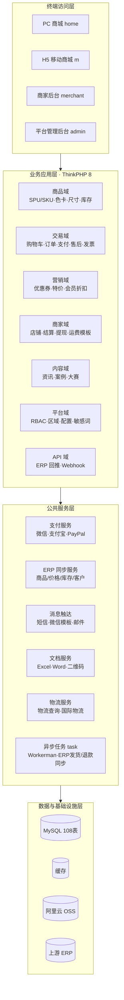

Portfolio
**项目一：# 原材料 B2B2C 贸易平台**

> **一句话介绍**：多商家B2B2C 垂直贸易平台——上游品牌供应商入驻开店，下游企业与采购方在线选购原材料，平台提供从商品展示、多维筛选、在线交易到结算分账的一站式数字化服务。

- **技术底座**：PHP 8 + ThinkPHP 8（多应用） + MySQL（108 张表）

---
## 一、界面截图

| PC 商城首页 | 商品列表 · 多维筛选 |
| :---: | :---: |
|  
) |  |

| 商品详情 · 行业色卡/尺寸规格 | 行业资讯  |
| :---: | :---: |
|  | |

|  平台管理后台（登录） | H5 移动商城 |
| :---: | :---: | :---: |
|  |  


---

## 二、技术栈

### 后端
| 类别 | 选型 |
| --- | --- |
| 语言 / 框架 | PHP ≥ 8.0 · ThinkPHP 8（`topthink/framework ^8.0`） |
| 应用架构 | `think-multi-app` 多应用：PC商城 / H5商城 / 商家后台 / 平台后台 / API / 支付 / 任务 |
| ORM | `topthink/think-orm ^3.0|^4.0` |
| 异步能力 | `topthink/think-worker ^4.0`（Workerman 常驻任务） |
| 数据库 | MySQL（`sys_` 前缀，108 张表） |
| 模板引擎 | `think-view` 服务端渲染 |

### 前端
- ThinkPHP 模板引擎 + Bootstrap 风格布局 + jQuery
- Layui· Swiper（轮播）· 中英双语切换（`zh-cn` / `en`）

### 第三方集成
| 能力 | 依赖 / 实现 |
| --- | --- |
| 微信支付 | `wechatpay/wechatpay ^1.4`（支持 PC / H5 / 小程序） |
| 支付宝 / PayPal | `alipaysdk/easysdk ^2.2` · `extend/payment/paypal` |
| 对象存储 | `aliyuncs/oss-sdk-php ^2.7`（阿里云 OSS） |
| 表格 / 文档 | `phpoffice/phpspreadsheet ^2.1`（Excel 含图片导出）· `phpoffice/phpword ^1.3` |
| 二维码 / 邮件 | `endroid/qr-code ^4.8` · `phpmailer/phpmailer ^6.8` |
| 短信 / 物流 | 阿里云短信（extend/sms/dayu）· 物流查询（extend/kuaidi100） |
| ERP 对接 | 上游 ERP 系统（`extend/erp/`）：品号 / 价格 / 库存 / 客户 / 仓库 / 销售评级 |
| 微信生态 | `extend/wechat`：公众号 Web、小程序、模板消息推送 |

---

## 三、系统架构



**设计要点**
- **多应用 + 服务端渲染**：PC / H5 / 商家 / 平台四端各为独立应用，`home` 与 `m` 共享商品、订单等业务服务，`merchant` 与 `admin` 走独立 RBAC 权限体系。
- **数据单向流动**：商品、价格、库存以 ERP 为准，通过同步服务落入本地 MySQL；订单支付完成后由 `payment` 应用回写状态并推送 ERP。
- **API 域面向第三方**：ERP 数据回推、Webhook 事件分发（订单状态 / 物流 / 退款）统一收敛在 `api` 应用。

---

## 四、核心功能模块

| 模块 | 说明 |
| --- | --- |
| 商品中心 | ERP 同步生成 SPU/SKU；品牌、三级分类、属性（形状）、色卡、SS/PP 尺寸、工艺多维规格；特价、会员折扣、多语言 |
| 交易中心 | 购物车、多商家订单拆分提交、合并支付、售后退款、发票管理、订单状态流转 |
| 商家中心 | 店铺装修、商品管理、订单履约、运费模板、结算单、提现、财务报表、子账号权限 |
| 营销中心 | 优惠券（满减）、特价活动、红包、会员等级折扣、热门搜索 |
| 内容中心 | 行业资讯、案例展示、创意大赛（报名/人数限制）、帮助中心、广告位 |
| 平台治理 | RBAC 权限、区域数据、参数配置、敏感词过滤、推送触达（短信/微信模板） |
| 开放对接 | 上游 ERP 双向同步、Webhook 事件、API Client 鉴权 |

---

## 五、核心难点与解决方案

### 1. ERP 全量数据同步：品号档案 → SPU/SKU 建模
- **难点**：上游 ERP 品号档案按"品类 + 规格"返回，需转换为商城"SPU（商品）— SKU（规格项）"两级模型；数万条数据一次同步必然超时；同步中断无法续跑。
- **方案**（`app/api/service/ErpGoodsSync.php`）：
  - 按 ERP 品类编码聚合生成 SPU，每条 ERP 记录生成 SKU；含特定后缀标识的编码拆分为独立商品主体；
  - 分页批量（默认每页 500 条）+ 每品类独立事务，单条失败不影响整体，错误写入日志与统计；
  - 游标续接（按处理位置 / 已处理数续跑）+ 自刷新进度页，支持任意断点续跑；
  - 品牌 / 分类 / 属性 / 规格 / 色组内存缓存，避免同步过程重复查库。

### 2. 水钻行业多维筛选：品牌 × 分类 × 属性 × 色卡 × 尺寸
- **难点**：原材料采购的筛选维度极多（国际品牌、三级分类、形状属性、数百色号、SS/PP 尺寸），且不同商家维护同名分类/颜色，需跨商家去重合并；全量加载色卡会拖慢页面。
- **方案**（`app/home/controller/Material.php`）：
  - 颜色 / 尺寸规格用**单次 JOIN** 拉取，按色系分组、Tab 懒加载（`group` 参数按需返回）；
  - 三级分类按名称去重合并（同名跨商家聚合为一条，`ids` 集合查询）；选中品牌后推导 `seller_id` 缩小范围；
  - 筛选结果 5 分钟缓存，热门筛选条件预聚合。

### 3. 库存口径统一：ERP 库存 + 本地库存，防超卖
- **难点**：SKU 可售库存由 ERP 库存与本地库存共同决定，展示口径与下单校验口径必须一致，否则超卖。
- **方案**（`app/home/service/Goods.php::getSellableStockBySku`）：
  - 统一可售库存计算函数，列表页展示、详情页、下单预校验全部走同一口径；
  - 下单在事务内重查实时库存，不足直接拦截；支付回调成功后才扣减销量。

### 4. 多商家合并支付：跨店铺购物车一次付清
- **难点**：一次购物车结算跨多个商家，需按商家拆分订单、合并支付，且支付回调必须幂等防重复发货。
- **方案**（`app/common/service/Payment.php`）：
  - 合并支付单 `order_payment` 以 `pay_sn` 关联多个 `order_id`；回调按单事务更新支付记录 + 各订单状态 + 销量；
  - **幂等**：已支付（`pay_status=10`）直接返回成功；**金额校验**：允许 1 分误差容错；订单状态二次判断防重复处理。

### 5. 价格体系：会员折扣 × 特价 × 优惠券 × 红包 叠加与互斥
- **难点**：水钻按色组给不同会员折扣（商品级与通用级取更优），特价 SKU 又禁止叠加券/红包，计价顺序必须唯一。
- **方案**（`app/home/service/Order.php`）：
  - 明确计价链：**会员折扣 → 特价（优先且禁券/红包）→ 优惠券 → 红包**；
  - 优惠券按商家隔离、跨商家防重复使用；特价批量预查（一次 SQL 查全部提交商品），避免 N+1 查询。

### 6. 商家结算与佣金体系
- **难点**：周期结算单需聚合订单佣金、退款冲抵、手续费，商家端只能看到本店数据。
- **方案**（`app/merchant/controller/Settlement.php`）：
  - 按周期（`cycle`）生成结算单，明细含订单佣金 / 退款佣金 / 实结金额 / 订单数与退款数；
  - 商家端查询强制 `seller_id` 过滤 + 明细详情二次鉴权，杜绝越权。

### 7. 行业特色数据模型（水钻行业的"灵魂"）
- **难点**：水钻 SKU 的规格不是普通"颜色/尺码"，而是**品牌色号体系**（如 `浅红[227]`、`印地安红[374]`）、**SS/PP 行业尺寸标准**、**工艺（M/G/U/F）**；外贸订单还需海关税号与毛净重。
- **方案**：
  - `goods_specs` 三级规格树（`color` / `size` / `work`），色卡由 `color_card` / `color_group` 支撑，中英双语列（`name` / `name_en`）；
  - SKU 携带 ERP 编码、条形码、关税号（`tariff_number`）、毛净重（`weight_g` / `weight_n`）；
  - 详情页支持**一键导出 Excel 规格明细**（含图片、可勾选列，`Material::exportExcel`），直出采购对账清单。

### 8. 异步与消息触达
- **难点**：支付后需触发订单推送 ERP、发货/退款状态回传，且微信模板消息有频率限制，同步执行会拖垮下单接口。
- **方案**：`task` 应用基于 Workerman 常驻执行 ERP 发货 / 退款同步（`ErpShipmentSync` / `ErpRefundSync`）；微信模板消息走队列（`WechatTemplatePushQueue`）批量限频发送。

---

## 六、项目文档
| 数据库备份 | `project.sql` | 完整结构 + 种子数据（108 张表） |


---

## 七、本地运行

### 环境要求
- PHP ≥ 8.0（含 `pdo_mysql`、`gd`、`curl`、`fileinfo` 扩展）
- MySQL 5.7+
- Nginx / Apache（ThinkPHP 伪静态，见 `public/nginx.htaccess`、`public/.htaccess`）

### 步骤
```bash
# 1. 导入数据库
mysql -uroot -p -e "CREATE DATABASE jingcai DEFAULT CHARACTER SET utf8mb4;"
mysql -uroot -p project < project.sql

# 2. 配置环境变量（数据库连接、域名、支付/短信密钥等）
#    编辑 .env，DB.HOST / DB.NAME / DB.USER / DB.PASS / DOMAIN 按实际环境填写

# 3. 安装依赖
composer install

# 4. 站点根目录指向 public/
```

> ⚠️ 支付、短信、OSS 等外部服务密钥以 `.env` 为准，`.env` 已加入 `.gitignore`，请勿提交到版本库。

---

## 八、目录结构

```
project/
├── app/                      # 多应用
│   ├── home/                 # PC 商城（商品/购物车/订单/支付/售后/发票）
│   ├── m/                    # H5 移动商城
│   ├── merchant/             # 商家后台（店铺/结算/提现/运费模板）
│   ├── admin/                # 平台管理后台（RBAC/内容/推送/治理）
│   ├── api/                  # 第三方接口（ERP 回推 / Webhook / 数据同步）
│   ├── payment/              # 支付回调
│   ├── task/                 # Workerman 异步任务（ERP 发货/退款同步）
│   └── common/               # 公共层（服务：支付/运费/Excel/上传/模板消息）
├── config/                   # 全局配置
├── extend/                   # 扩展库
│   ├── erp/                  # 上游 ERP 对接 API
│   ├── payment/              # wxpay / alipay / paypal
│   ├── sms/                  # 阿里云短信
│   ├── wechat/               # 公众号 / 小程序 / 模板消息
│   └── kuaidi100/            # 物流查询
├── public/                   # 站点根目录（入口 + 静态资源 + 上传）
├── runtime/                  # 运行时缓存与日志
├── project.sql               # 数据库备份
├── composer.json
└── .env                      # 环境变量（不入库）
```

---

**项目二：# 企业采购管理系统**

## 项目简介

这是一个面向企业客户的采购管理系统，支持企业员工在线浏览和采购商品，并由企业管理员统一管理商品、订单、员工、采购额度、审批流程及相关权限。

系统以企业为数据隔离边界，结合员工角色和权限控制，满足不同企业、不同岗位在采购申请、订单处理和后台管理中的差异化使用需求。

## 技术栈
- **前台**：vue3 + pinna + elemnt ui
- **后端语言**：PHP 8+
- **后端框架**：ThinkPHP 8
- **数据访问**：ThinkPHP ORM
- **应用架构**：ThinkPHP 多应用模式，划分管理端、用户端 API、公共服务和任务处理模块
- **前端管理界面**：ThinkPHP 模板引擎 + Layui
- **数据库**：MySQL
- **异步与定时处理**：ThinkPHP Worker、ThinkPHP CronJob
- **第三方能力**：微信支付、支付宝、阿里云 OSS
- **文档与数据处理**：PhpSpreadsheet、PhpWord、Endroid QR Code

---

## 界面截图

| PC 商城首页(响应式) | 商品列表 · 多维筛选 |
| :---: | :---: |
|  |  |
| 商品详情 · 行业色卡/尺寸规格 | 行业资讯  |
| :---: | :---: |
|  | |

| 后台（企业） | 后台（订单） |
| :---: | :---: | :---: |
|  |  | 
| :---: | :---: |

---

## 主要业务功能

- 商品分类、商品信息、SKU 及库存管理
- 面向企业的采购价格配置
- 企业账号、员工账号和岗位角色管理
- 采购额度分配、使用、冻结和返还
- 订单创建、订单审批、发货、结算和售后退款
- 动态多级审批流程配置与审批记录追踪
- 管理端菜单、角色和权限控制
- 企业维度及角色维度的数据访问隔离
- 消息通知、支付、文件上传和定时任务等基础能力

## 个人负责内容

我主要负责以下业务模块的开发和维护：

- 商品管理：商品信息、分类、SKU、库存及企业采购价相关功能
- 订单管理：订单创建、订单状态流转、订单详情、发货、结算和退款相关功能
- 企业账号：企业信息、员工账号、岗位类型和员工额度管理
- 审批功能：审批流配置、动态多级审批节点、审批记录和审批结果处理
- 采购额度：企业额度分配、员工额度校验、额度使用、冻结、释放和返还
- 权限控制：根据企业和角色限制数据访问范围，控制不同用户可以执行的操作

## 重点业务设计

### 动态多级审批

系统支持按企业配置审批流程和审批节点。员工提交采购订单后，系统根据企业规则生成对应的审批记录，并按节点顺序推进审批：

1. 员工提交采购订单
2. 系统匹配企业审批流并生成审批节点
3. 当前审批人处理申请
4. 当前节点通过后进入下一级节点
5. 全部节点通过后，订单进入后续处理流程
6. 任一节点驳回后，订单结束审批并执行额度回退逻辑

### 额度冻结与回退

为避免多个订单同时使用同一笔可用额度，订单提交时会先校验可用额度并冻结对应金额。额度状态大致分为已分配、已使用和冻结三部分：

- **提交订单**：校验可用额度，增加冻结额度
- **审批通过并完成后续流程**：将冻结额度转为实际使用额度
- **审批驳回或订单取消**：释放已冻结额度
- **退款或售后完成**：按业务结果返还或调整已使用额度

该设计保证了订单审批期间额度不会被重复占用，同时使订单状态和额度流水保持一致。

## 开发中的重点与难点

### 相对容易的部分

- 商品和企业信息的增删改查
- 管理端列表、详情和编辑页面
- 商品分类、员工信息和基础状态管理
- 常规菜单、按钮和角色权限配置

### 需要重点处理的部分

- **审批流程的动态性**：审批节点不是固定写死的，需要根据企业配置生成、推进和记录流程状态。
- **额度状态的一致性**：订单状态变化会影响冻结、使用和可用额度，需要保证不同操作下金额变化正确且可追溯。
- **订单与审批的联动**：订单创建、审批通过、驳回、取消、结算和退款之间存在前后依赖，状态流转必须保持清晰。
- **企业和角色的数据隔离**：同一套系统服务多个企业，需要在查询、修改和业务操作时持续校验企业归属及角色权限。
- **异常场景处理**：需要考虑重复提交、审批中的订单取消、退款回退以及额度不足等情况，避免出现重复扣减或额度无法释放。

## 信息范围说明

本文档仅描述项目的业务定位、技术栈和个人负责内容，不包含客户名称、账号密码、密钥、生产环境地址、内部数据或未公开的部署信息。


